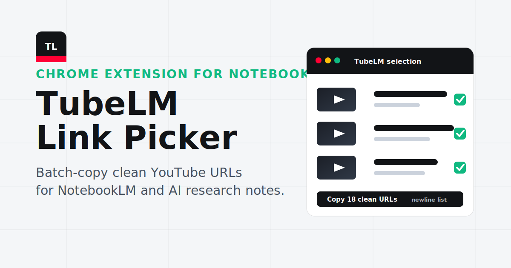

  

<h1 align="center">TubeLM Link Picker</h1>

  <strong>Batch-select YouTube videos and Shorts, copy clean URLs, and paste them into NotebookLM or any AI research notebook.</strong>

  <a href="https://bakhtiersizhaev.github.io/tubelm-link-picker/">Website</a>
  |
  <a href="https://github.com/bakhtiersizhaev/tubelm-link-picker/archive/refs/heads/main.zip">Download ZIP</a>
  |
  <a href="https://notebooklm.google.com/">NotebookLM</a>
  |
  <a href="#english">English</a>
  |
  <a href="#russian">Русский</a>
  |
  <a href="#chinese">中文</a>
  |
  <a href="#spanish">Español</a>

## Quick Idea

TubeLM Link Picker is a lightweight Chrome extension for collecting YouTube links in bulk.

Open a YouTube channel, playlist, search results page, feed, or Shorts grid. TubeLM adds checkboxes to video thumbnails, lets you select the videos you need, and copies a clean newline-separated list of YouTube URLs to your clipboard.

The main workflow is:

1. Select videos on YouTube.
2. Copy their clean links with TubeLM.
3. Paste those links into [NotebookLM](https://notebooklm.google.com/) as sources.
4. Ask questions, create notes, build study material, or analyze the videos with AI.

## Features

- Select multiple YouTube videos and Shorts directly on the page.
- Copy clean `youtube.com/watch?v=...` and `youtube.com/shorts/...` URLs.
- Use **Select visible** to grab all loaded videos in the current view.
- Works on channel pages, playlists, search results, home feeds, related videos, and Shorts surfaces.
- Runs locally in your browser. No backend, no account, no analytics.
- Built for NotebookLM, AI notes, research workflows, study plans, content curation, and knowledge bases.

<h2 id="english">English: Install For Beginners</h2>

This extension is not installed from the Chrome Web Store yet. You install it as an **unpacked extension**. That means you download the project folder, unzip it, and tell Chrome to load that folder.

### Step 1: Download TubeLM From GitHub

1. Open the project page: [github.com/bakhtiersizhaev/tubelm-link-picker](https://github.com/bakhtiersizhaev/tubelm-link-picker).
2. Click the green **Code** button near the top of the page.
3. Click **Download ZIP**.
4. You can also use this direct link: [Download TubeLM ZIP](https://github.com/bakhtiersizhaev/tubelm-link-picker/archive/refs/heads/main.zip).
5. Wait until the ZIP file finishes downloading.

### Step 2: Unzip The File

1. Find the downloaded file. It is usually in your **Downloads** folder.
2. The file name will look like `tubelm-link-picker-main.zip`.
3. Right-click the ZIP file.
4. Click **Extract All...**, **Unzip**, or **Extract Here**. The exact text depends on your computer.
5. After extraction, open the new folder.
6. Make sure you can see a file named `manifest.json` inside the folder.

Important: Chrome needs the **unpacked folder**, not the ZIP file. If you select the ZIP file, the extension will not load.

### Step 3: Open Chrome Extensions

1. Open Google Chrome.
2. Copy this address: `chrome://extensions`
3. Paste it into the Chrome address bar.
4. Press **Enter**.

### Step 4: Turn On Developer Mode

1. On the Extensions page, find **Developer mode**.
2. Turn it on. It is usually in the top-right corner.
3. New buttons will appear, including **Load unpacked**.

### Step 5: Load TubeLM

1. Click **Load unpacked**.
2. Select the extracted TubeLM folder.
3. Choose the folder that contains `manifest.json`.
4. Click **Select Folder**, **Open**, or the confirm button your system shows.
5. TubeLM should now appear in the Chrome extensions list.

### Step 6: Pin TubeLM

1. Click the puzzle-piece icon in the Chrome toolbar.
2. Find **TubeLM Link Picker**.
3. Click the pin icon next to it.
4. TubeLM will stay visible in the toolbar.

### Step 7: Use TubeLM On YouTube

1. Open [youtube.com](https://www.youtube.com/).
2. Go to a channel, playlist, search results page, home feed, or Shorts page.
3. Wait for the videos to load.
4. TubeLM adds checkboxes on top of video thumbnails.
5. Click the checkboxes for the videos you want.
6. Open the TubeLM extension popup.
7. Click **Copy URLs**.
8. Open [NotebookLM](https://notebooklm.google.com/).
9. Create or open a notebook.
10. Add sources and paste the copied YouTube links.

### If Something Does Not Work

- If Chrome says it cannot load the extension, make sure you selected the folder with `manifest.json`.
- If you do not see checkboxes on YouTube, reload the YouTube tab.
- If the popup says to open a YouTube tab, switch to YouTube and open the popup again.
- If Chrome shows a developer-mode message, that is normal for unpacked extensions.
- If you downloaded a new version, remove the old TubeLM card from `chrome://extensions` and load the new unpacked folder again.

<h2 id="russian">Русский: установка для новичков</h2>

Это расширение пока устанавливается не из Chrome Web Store, а как **распакованное расширение**. Это значит: нужно скачать папку проекта с GitHub, распаковать ZIP-архив и показать эту папку Google Chrome.

### Шаг 1: скачайте TubeLM с GitHub

1. Откройте страницу проекта: [github.com/bakhtiersizhaev/tubelm-link-picker](https://github.com/bakhtiersizhaev/tubelm-link-picker).
2. Нажмите зелёную кнопку **Code** в верхней части страницы.
3. Нажмите **Download ZIP**.
4. Можно сразу открыть прямую ссылку: [скачать TubeLM ZIP](https://github.com/bakhtiersizhaev/tubelm-link-picker/archive/refs/heads/main.zip).
5. Дождитесь, пока архив скачается.

### Шаг 2: распакуйте ZIP-архив

1. Найдите скачанный файл. Обычно он лежит в папке **Загрузки**.
2. Файл будет называться примерно так: `tubelm-link-picker-main.zip`.
3. Нажмите по ZIP-файлу правой кнопкой мыши.
4. Выберите **Извлечь все...**, **Распаковать** или похожий пункт.
5. После распаковки откройте новую папку.
6. Проверьте, что внутри есть файл `manifest.json`.

Важно: в Chrome нужно выбирать именно **распакованную папку**, а не ZIP-файл. Если выбрать ZIP-файл, расширение не установится.

### Шаг 3: откройте страницу расширений Chrome

1. Откройте Google Chrome.
2. Скопируйте адрес: `chrome://extensions`
3. Вставьте его в адресную строку Chrome.
4. Нажмите **Enter**.

### Шаг 4: включите режим разработчика

1. На странице расширений найдите переключатель **Режим разработчика**.
2. Включите его. Обычно он находится справа сверху.
3. После этого появится кнопка **Загрузить распакованное**.

### Шаг 5: загрузите TubeLM в Chrome

1. Нажмите **Загрузить распакованное**.
2. Выберите распакованную папку TubeLM.
3. Нужна именно та папка, внутри которой лежит `manifest.json`.
4. Нажмите **Выбор папки**, **Открыть** или похожую кнопку подтверждения.
5. TubeLM должен появиться в списке расширений Chrome.

### Шаг 6: закрепите TubeLM на панели

1. Нажмите иконку пазла в правом верхнем углу Chrome.
2. Найдите **TubeLM Link Picker**.
3. Нажмите иконку булавки рядом с расширением.
4. Теперь TubeLM будет виден на панели Chrome.

### Шаг 7: используйте TubeLM на YouTube

1. Откройте [youtube.com](https://www.youtube.com/).
2. Перейдите на канал, плейлист, страницу поиска, главную ленту или Shorts.
3. Подождите, пока видео загрузятся.
4. TubeLM добавит чекбоксы поверх превью роликов.
5. Отметьте нужные видео.
6. Откройте попап расширения TubeLM.
7. Нажмите **Copy URLs**.
8. Откройте [NotebookLM](https://notebooklm.google.com/).
9. Создайте новый notebook или откройте существующий.
10. Добавьте источники и вставьте скопированные ссылки YouTube.

### Если что-то не работает

- Если Chrome пишет, что расширение не загружается, проверьте, что вы выбрали папку с `manifest.json`.
- Если на YouTube не появились чекбоксы, перезагрузите вкладку YouTube.
- Если попап просит открыть YouTube, переключитесь на вкладку YouTube и откройте попап снова.
- Если Chrome показывает сообщение про режим разработчика, это нормально для распакованных расширений.
- Если вы скачали новую версию, удалите старую карточку TubeLM на `chrome://extensions` и загрузите новую распакованную папку.

<h2 id="chinese">中文：新手安装教程</h2>

TubeLM 目前还不是从 Chrome Web Store 安装的扩展。你需要把它作为**已解压的扩展程序**安装：先从 GitHub 下载 ZIP，解压，然后让 Chrome 加载解压后的文件夹。

### 第 1 步：从 GitHub 下载 TubeLM

1. 打开项目页面：[github.com/bakhtiersizhaev/tubelm-link-picker](https://github.com/bakhtiersizhaev/tubelm-link-picker)。
2. 点击页面上方绿色的 **Code** 按钮。
3. 点击 **Download ZIP**。
4. 也可以直接点击这里下载：[Download TubeLM ZIP](https://github.com/bakhtiersizhaev/tubelm-link-picker/archive/refs/heads/main.zip)。
5. 等待 ZIP 文件下载完成。

### 第 2 步：解压 ZIP 文件

1. 找到下载好的文件。通常在 **Downloads** 文件夹里。
2. 文件名大概是 `tubelm-link-picker-main.zip`。
3. 右键点击这个 ZIP 文件。
4. 选择 **Extract All...**、**Unzip**、**解压到当前文件夹** 或类似选项。
5. 解压后，打开新生成的文件夹。
6. 确认这个文件夹里有一个文件叫 `manifest.json`。

重要：Chrome 需要选择的是**解压后的文件夹**，不是 ZIP 文件。如果选择 ZIP 文件，扩展不会加载成功。

### 第 3 步：打开 Chrome 扩展程序页面

1. 打开 Google Chrome。
2. 复制这个地址：`chrome://extensions`
3. 粘贴到 Chrome 地址栏。
4. 按 **Enter**。

### 第 4 步：开启开发者模式

1. 在扩展程序页面找到 **Developer mode**（开发者模式）。
2. 打开它。通常在页面右上角。
3. 开启后会出现 **Load unpacked** 按钮。

### 第 5 步：加载 TubeLM

1. 点击 **Load unpacked**。
2. 选择刚才解压出来的 TubeLM 文件夹。
3. 一定要选择包含 `manifest.json` 的那个文件夹。
4. 点击 **Select Folder**、**Open** 或系统显示的确认按钮。
5. TubeLM 应该会出现在 Chrome 扩展程序列表中。

### 第 6 步：固定 TubeLM 图标

1. 点击 Chrome 工具栏右上角的拼图图标。
2. 找到 **TubeLM Link Picker**。
3. 点击它旁边的图钉图标。
4. TubeLM 图标就会固定在 Chrome 工具栏上。

### 第 7 步：在 YouTube 上使用 TubeLM

1. 打开 [youtube.com](https://www.youtube.com/)。
2. 进入频道、播放列表、搜索结果页、首页推荐流或 Shorts 页面。
3. 等待视频加载完成。
4. TubeLM 会在视频缩略图上添加复选框。
5. 勾选你需要的视频。
6. 打开 TubeLM 扩展弹窗。
7. 点击 **Copy URLs**。
8. 打开 [NotebookLM](https://notebooklm.google.com/)。
9. 创建或打开一个 notebook。
10. 添加 sources，然后粘贴刚才复制的 YouTube 链接。

### 如果无法正常使用

- 如果 Chrome 提示无法加载扩展，请确认你选择的是包含 `manifest.json` 的文件夹。
- 如果 YouTube 页面没有出现复选框，请刷新 YouTube 标签页。
- 如果弹窗提示需要打开 YouTube 标签页，请切换到 YouTube 后再次打开 TubeLM。
- 如果 Chrome 显示开发者模式提示，这是已解压扩展的正常现象。
- 如果你下载了新版本，请先在 `chrome://extensions` 删除旧的 TubeLM，再重新加载新的解压文件夹。

<h2 id="spanish">Español: instalación para principiantes</h2>

Esta extensión todavía no se instala desde Chrome Web Store. Se instala como una **extensión descomprimida**. Eso significa que descargas la carpeta del proyecto, descomprimes el ZIP y le dices a Chrome que cargue esa carpeta.

### Paso 1: descarga TubeLM desde GitHub

1. Abre la página del proyecto: [github.com/bakhtiersizhaev/tubelm-link-picker](https://github.com/bakhtiersizhaev/tubelm-link-picker).
2. Haz clic en el botón verde **Code** cerca de la parte superior.
3. Haz clic en **Download ZIP**.
4. También puedes usar este enlace directo: [Descargar TubeLM ZIP](https://github.com/bakhtiersizhaev/tubelm-link-picker/archive/refs/heads/main.zip).
5. Espera a que termine la descarga.

### Paso 2: descomprime el archivo

1. Busca el archivo descargado. Normalmente está en la carpeta **Descargas**.
2. El archivo se llamará algo como `tubelm-link-picker-main.zip`.
3. Haz clic derecho sobre el ZIP.
4. Elige **Extraer todo...**, **Descomprimir** o una opción similar.
5. Después de extraerlo, abre la nueva carpeta.
6. Comprueba que dentro exista un archivo llamado `manifest.json`.

Importante: Chrome necesita la **carpeta descomprimida**, no el archivo ZIP. Si eliges el ZIP, la extensión no se cargará.

### Paso 3: abre la página de extensiones de Chrome

1. Abre Google Chrome.
2. Copia esta dirección: `chrome://extensions`
3. Pégala en la barra de direcciones de Chrome.
4. Pulsa **Enter**.

### Paso 4: activa el modo desarrollador

1. En la página de extensiones, busca **Developer mode** o **Modo de desarrollador**.
2. Actívalo. Normalmente está en la esquina superior derecha.
3. Aparecerán nuevos botones, incluido **Load unpacked** o **Cargar descomprimida**.

### Paso 5: carga TubeLM

1. Haz clic en **Load unpacked** o **Cargar descomprimida**.
2. Selecciona la carpeta TubeLM descomprimida.
3. Debe ser la carpeta que contiene `manifest.json`.
4. Haz clic en **Select Folder**, **Open**, **Seleccionar carpeta** o el botón de confirmación que muestre tu sistema.
5. TubeLM debería aparecer en la lista de extensiones de Chrome.

### Paso 6: fija TubeLM en la barra

1. Haz clic en el icono de pieza de rompecabezas en la barra de Chrome.
2. Busca **TubeLM Link Picker**.
3. Haz clic en el icono de pin junto a la extensión.
4. TubeLM quedará visible en la barra de Chrome.

### Paso 7: usa TubeLM en YouTube

1. Abre [youtube.com](https://www.youtube.com/).
2. Entra en un canal, playlist, resultados de búsqueda, inicio o página de Shorts.
3. Espera a que los videos carguen.
4. TubeLM añadirá checkboxes sobre las miniaturas.
5. Marca los videos que necesitas.
6. Abre el popup de TubeLM.
7. Haz clic en **Copy URLs**.
8. Abre [NotebookLM](https://notebooklm.google.com/).
9. Crea o abre un notebook.
10. Añade fuentes y pega los enlaces de YouTube copiados.

### Si algo no funciona

- Si Chrome dice que no puede cargar la extensión, asegúrate de seleccionar la carpeta que contiene `manifest.json`.
- Si no ves checkboxes en YouTube, recarga la pestaña de YouTube.
- Si el popup dice que abras una pestaña de YouTube, cambia a YouTube y abre el popup otra vez.
- Si Chrome muestra un aviso de modo desarrollador, es normal para extensiones descomprimidas.
- Si descargaste una nueva versión, elimina la tarjeta antigua de TubeLM en `chrome://extensions` y carga de nuevo la carpeta descomprimida.

## Naming

The original working name was **URLTube**. The product name is now **TubeLM Link Picker**:

- **TubeLM** is short, memorable, and distinct enough to brand.
- **Link Picker** says what the extension actually does.
- The README, manifest, page title, and descriptions still include the important search phrases: YouTube links, NotebookLM, Chrome extension, batch copy, Shorts, playlists, channels, and research workflow.

## SEO Positioning

Primary phrase:

`YouTube link picker for NotebookLM`

Secondary phrases:

- batch copy YouTube URLs
- YouTube links for NotebookLM
- NotebookLM YouTube source helper
- Chrome extension for YouTube research
- copy YouTube Shorts links
- collect YouTube video links
- AI research notes from YouTube

Suggested GitHub topics:

`notebooklm`, `youtube`, `chrome-extension`, `browser-extension`, `youtube-links`, `shorts`, `research-tool`, `ai-notes`, `llm-tools`, `knowledge-base`, `clipboard`, `productivity`

## Privacy

TubeLM runs locally in your browser. It does not send YouTube links, page data, selections, or clipboard contents to any server. Clipboard access is used only when you click the copy button.

## Roadmap

- Optional auto-scroll collection mode for long channel and playlist pages.
- Export selected links as Markdown, CSV, or plain text.
- Saved selection sets per tab.
- Chrome Web Store listing assets and screenshots.
- Localization files for the extension popup.

## References

- [Chrome official guide: load an unpacked extension](https://developer.chrome.com/docs/extensions/get-started/tutorial/hello-world#load-unpacked)
- [GitHub official guide: downloading files from GitHub](https://docs.github.com/en/get-started/start-your-journey/downloading-files-from-github)

## Disclaimer

TubeLM Link Picker is an independent open-source project. It is not affiliated with Google, YouTube, or NotebookLM.
